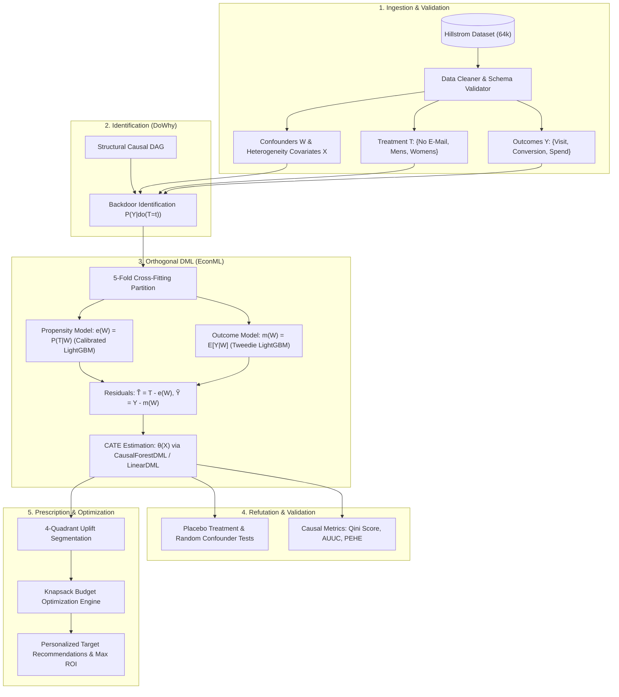

# EconoCausal
### AI-Powered Personalized Marketing Campaign Optimization using Causal AI

## Project Overview
EconoCausal is a production-grade AI system designed to optimize marketing campaigns by estimating the Individual Treatment Effect (ITE) of marketing interventions on customer behavior. Using advanced Causal AI methodologies (such as Double Machine Learning), the system identifies the incremental impact of a campaign (e.g., sending an email) on a specific user's likelihood to purchase or spend. This allows the business to efficiently allocate limited marketing budgets toward customers who are truly influenced by the campaign, maximizing overall ROI.

## Business Problem
A company wants to optimize its marketing campaigns to maximize revenue while minimizing unnecessary campaign costs. When running promotions, a business generally reaches out to a broad audience, but not all customers respond equally. Some customers will purchase only if they receive a promotion (Persuadables), some will purchase regardless of the promotion (Sure Things), some will never purchase (Lost Causes), and some might even be alienated by the promotion (Sleeping Dogs). 

The challenge is identifying the "Persuadables"—the specific customers who are actually influenced by the campaign. Traditional marketing blasts are inefficient because they waste resources on non-responsive or organic buyers.

## Motivation
Traditional Machine Learning models answer predictive questions like: "Will a customer purchase?" However, predicting high purchase probability doesn't mean the customer *needs* a promotion; they might buy anyway. By shifting from predictive ML to Causal ML, we transition from answering "What will happen?" to "What will happen *if* we take this action?".

## Objectives
- Estimate the Individual Treatment Effect (ITE) of marketing campaigns (e.g., Email vs. No Email).
- Identify which customers yield the highest incremental ROI when targeted with a campaign.
- Build a generic, modular, and scalable architecture capable of incorporating future treatment types (coupons, cashback, push notifications).
- Ensure a production-ready codebase utilizing SOLID principles, robust logging, type hints, and configuration management.

## Real-world Use Case
An e-commerce platform wants to send a "10% off" email campaign. Instead of blasting 1 million users and paying the email delivery and discount costs for everyone, EconoCausal analyzes past experimental data. It scores all users based on their ITE. The platform then targets only the top 200,000 users whose incremental probability to spend significantly outweighs the cost of the campaign, substantially boosting net revenue.

## Dataset Description
The project utilizes the **Hillstrom Email Marketing Dataset (MineThatData)**. This dataset contains results from an email marketing experiment conducted in 2008 involving 64,000 customers. Customers were randomly assigned to receive a Mens E-Mail, a Womens E-Mail, or No E-Mail. The dataset tracks their historical activity and subsequent behavior (website visit, conversion, and spend) over a two-week period following the campaign.

## Dataset Analysis
An initial exploratory data analysis reveals the following dataset properties:
- **Size**: 64,000 rows and 12 columns.
- **Missing Values**: 0 missing values across all columns.
- **Data Quality**: Clean, well-structured, and suitable for causal inference due to the randomized control trial nature of the campaign assignment.
- **Distributions**: Most customers have a recency between 2 and 9 months. The overall conversion rate is roughly 0.9%, and the average spend is $1.05.

## Treatment
The intervention applied to the customer.
- **Variable**: `segment`
- **Values**: 'Womens E-Mail', 'Mens E-Mail', 'No E-Mail' (Control group).

## Outcome
The business metrics we aim to optimize.
- **Variables**: `visit` (binary: 1 if visited, 0 otherwise), `conversion` (binary: 1 if purchased, 0 otherwise), `spend` (continuous: amount spent in dollars).

## Features
Observable characteristics of the customer used by the models to learn heterogeneity.
- `recency`: Months since last purchase.
- `history_segment`: Categorization of historical spend.
- `history`: Actual historical spend value.
- `mens`: Binary indicator for purchasing mens merchandise in the past year.
- `womens`: Binary indicator for purchasing womens merchandise in the past year.
- `zip_code`: Customer location type (Surburban, Rural, Urban).
- `newbie`: Binary indicator if the customer is new in the past 12 months.
- `channel`: Primary interaction channel (Phone, Web, Multichannel).

## Confounders
Variables that affect both the treatment assignment and the outcome. While the Hillstrom dataset comes from a Randomized Controlled Trial (where treatment assignment is technically independent of user features), in observational data settings, features like `history`, `recency`, and `channel` would act as strong confounders. Our causal graph models these features as confounders to maintain a generalizable architecture that works with observational, non-randomized data in the future.

## Causal AI Concept
Causal AI goes beyond correlations to understand cause-and-effect relationships. It allows us to ask counterfactual questions: "What would have happened if we didn't send the email to this specific user?". It combines causal graphs (representing assumptions about the world) with advanced statistical estimation techniques to isolate the true effect of an intervention.

## Why Traditional ML is insufficient
Traditional ML focuses on correlation and prediction ($P(Y|X)$). If an ML model is trained to predict `conversion`, it will naturally score "Sure Things" highly because they have a high baseline probability of buying. Sending discounts to them wastes money. Traditional ML suffers from "confounding bias" and cannot separate the organic purchase probability from the campaign-driven purchase probability.

## Why Causal AI
Causal AI models estimate the causal effect ($P(Y|do(X))$). By controlling for confounders, it isolates the delta in probability or spend caused explicitly by the treatment. This aligns perfectly with the business goal of identifying true incremental lift.

## Individual Treatment Effect
The Individual Treatment Effect (ITE) measures the causal effect of a treatment for a specific individual.
$$ITE_i = Y_i(Treatment) - Y_i(Control)$$
In this project, it represents how much *extra* a specific customer is expected to spend if they receive the email compared to if they do not.

## Average Treatment Effect
The Average Treatment Effect (ATE) is the average of ITEs across the entire population. It tells us whether the campaign was effective globally, but it lacks the personalization needed for targeted marketing.

## Double Machine Learning
Double Machine Learning (DML) is a technique for estimating ITE using any arbitrary ML model (e.g., LightGBM, XGBoost, Random Forests). It involves three stages:
1. **Treatment Model**: Predict the treatment probability (Propensity Score) using confounders.
2. **Outcome Model**: Predict the outcome using confounders.
3. **Causal Model**: Regress the outcome residuals on the treatment residuals to estimate the causal effect.

DML is highly robust and performs well even with high-dimensional data, minimizing regularization bias.

## DoWhy
DoWhy is a Python library by Microsoft that provides a 4-step framework for causal inference:
1. **Model**: Define the causal graph (Nodes and Edges).
2. **Identify**: Formulate the target estimand (e.g., Backdoor criterion).
3. **Estimate**: Use a statistical or ML method to estimate the effect.
4. **Refute**: Test the robustness of the estimate using sensitivity analysis (e.g., adding a random confounder, placebo treatment).

EconoCausal integrates DoWhy to formally define the causal assumptions and rigorously validate the estimated effects.

## EconML
EconML is a Python library by Microsoft designed specifically for estimating heterogeneous treatment effects (ITE) using modern Machine Learning. We leverage EconML to perform the actual estimation step within the DoWhy framework, utilizing advanced algorithms like LinearDML, CausalForestDML, or XLearner.

## Business Workflow
1. **Data Collection**: Gather historical data of customers, interventions (campaigns), and outcomes.
2. **Causal Modeling**: Train the Double Machine Learning model to learn the ITE mappings.
3. **Inference**: For an upcoming campaign, feed the active customer base into the model to predict their ITEs.
4. **Optimization**: Rank customers by ITE. Select the top N customers based on marketing budget or a predefined ROI threshold.
5. **Execution**: Send the campaign to the targeted users.
6. **Monitoring**: Track performance and feed new data back into the pipeline.

## Complete Causal AI Pipeline



---

## Enterprise Causal ML Architecture

For the complete research-grade specification, see [docs/model_architecture.md](file:///d:/Coding/EconoCausal/docs/model_architecture.md).

### 1. Structural Causal Model & Identification
The system formalizes the marketing intervention as a Structural Causal Model (SCM) $\mathcal{M} = \langle V, U, \mathcal{F}, P(U) \rangle$:
- **Treatment ($T$)**: Discrete campaign assignment $\in \{0: \text{Control}, 1: \text{Mens E-Mail}, 2: \text{Womens E-Mail}\}$.
- **Outcomes ($Y$)**: Multi-objective tracking: `visit` (binary engagement), `conversion` (binary intent), `spend` (continuous revenue).
- **Confounders ($W$) & Effect Modifiers ($X$)**: Customer recency, historical spend, channel, zip code, and merchandise affinity.
- **Identification**: Satisfies the Backdoor Criterion relative to $(T, Y)$ via adjustment formula:
  $$P(Y \mid do(T=t)) = \int_{\mathcal{X}} P(Y \mid T=t, X=x) P(X=x) dx$$

### 2. Double Machine Learning (DML) Formulation
EconoCausal solves the Partially Linear Model with heterogeneous treatment effects:
$$Y = \theta(X) \cdot T + g(W) + \varepsilon, \quad \mathbb{E}[\varepsilon \mid X, W, T] = 0$$
$$T = m(W) + \eta, \quad \mathbb{E}[\eta \mid X, W] = 0$$

Using the **Robinson transformation**, we project out confounder effects from both outcome and treatment:
$$\widetilde{Y} = Y - \mathbb{E}[Y \mid W], \quad \widetilde{T} = T - \mathbb{E}[T \mid W] \implies \widetilde{Y} = \theta(X) \cdot \widetilde{T} + \varepsilon$$

By employing the **Neyman Orthogonal Score**:
$$\psi(W, Y, T; \theta, \eta) = \Big( (Y - \hat{g}(W)) - \theta(X) (T - \hat{m}(W)) \Big) (T - \hat{m}(W))$$
The target parameter $\hat{\theta}(X) = \text{CATE}(X)$ is immune to first-stage regularization biases, achieving $\sqrt{n}$-consistency through $5$-fold cross-fitting.

### 3. Estimator Engine Matrix
- **`LinearDML`**: Regularized linear projection for interpretable parametric baselines with closed-form confidence intervals.
- **`CausalForestDML`**: Primary production estimator for complex non-linear heterogeneity surfaces without parametric assumptions.
- **`Meta-Learners` (X-Learner / T-Learner)**: Comparative benchmarks for extreme treatment imbalance.

### 4. Uplift Customer Segmentation (4-Quadrant Framework)
Customers are categorized based on baseline potential outcome $\mathbb{E}[Y(0) \mid X]$ and predicted treatment effect $\tau(X)$:
1. **Persuadables** ($\tau(X) > \gamma$): Targeted with highest priority (true positive incremental ROI).
2. **Sure Things** ($\mathbb{E}[Y(0) \mid X] > \alpha, |\tau(X)| \le \gamma$): Organic purchasers; marketing is withheld to avoid budget waste.
3. **Lost Causes** ($\mathbb{E}[Y(1) \mid X] \le \alpha, \mathbb{E}[Y(0) \mid X] \le \alpha$): Non-responsive; zero campaign allocation.
4. **Sleeping Dogs** ($\tau(X) < -\gamma$): Campaign triggers negative response or unsubscribe; strictly excluded.

### 5. Prescriptive Budget Optimization
The allocation engine solves a constrained mixed-integer optimization problem:
$$\max_{\{z_{i, t}\}} \sum_{i=1}^N \sum_{t=1}^2 z_{i, t} \cdot \left( \hat{\tau}_{\text{spend}, t}(X_i) \cdot \text{Margin} - c_t \right) \quad \text{s.t.} \quad \sum_{i=1}^N \sum_{t=1}^2 z_{i, t} c_t \le \text{Budget}, \quad \sum_{t=1}^2 z_{i, t} \le 1$$
Relaxed and solved via greedy marginal return on intervention cost (MROIC) in $O(N \log N)$ time.

### 6. Causal Validation & Metric Suite
- **Qini Curve & Qini Score**: Quantifies cumulative uplift over random targeting.
- **AUUC (Area Under Uplift Curve)**: Evaluates ranking quality across targeting percentiles.
- **DoWhy Refutation Suite**: Falsification via Random Common Cause, Placebo Treatment, and Data Subset refuters.
- **PEHE Benchmark**: Evaluates CATE mean squared error against a semi-synthetic data-generating oracle.

---

## Modular Pipeline Directory Structure

```text
EconoCausal/
├── configs/            # YAML configurations (hyperparameters, causal DAG, logging)
├── datasets/           # Raw (Hillstrom RCT), processed, and external benchmark data
├── docs/               # Research notes, feature dictionary, and model architecture specs
├── experiments/        # Versioned runs: EDA, propensity, DML, tuning, model comparisons
├── ml/                 # Enterprise Python package (loaders, DML, CATE, optimizers, metrics)
├── models/             # Serialized transformers, fitted estimators, and SHAP artifacts
├── notebooks/          # 18 sequential research-grade Jupyter notebooks (01 to 18)
├── reports/            # Publication-grade uplift plots, Qini curves, and refutation logs
└── tests/              # Automated unit, schema, and causal integration tests
```

---

## Technology Stack
- **Language**: Python 3.12+
- **Causal Inference**: DoWhy, EconML
- **Machine Learning**: Scikit-Learn, LightGBM, XGBoost
- **Scientific Computing & Optimization**: NumPy, SciPy, Pandas
- **Explainability**: SHAP (Causal Tree & Kernel Explainer)
- **Code Quality & Testing**: Pytest, Black, Flake8, Mypy

## Project Roadmap
- **Phase 1: Understanding & Design**: Dataset analysis, architecture design, and README generation. *(Completed)*
- **Phase 2: Data Engineering**: Implement robust data loaders and preprocessors.
- **Phase 3: Causal Modeling**: Implement the DoWhy+EconML DML pipeline.
- **Phase 4: Evaluation & Refutation**: Add comprehensive metrics, visualizations, and robustness tests.
- **Phase 5: Productization**: Refactor into a scalable package with configuration management and API endpoints.

## Future Scope
- **Multi-Treatment Support**: Extending the model to evaluate multiple competing campaigns simultaneously (e.g., $10 vs $20 discount).
- **Uplift Modeling Integration**: Comparing DML results with traditional Meta-Learners (T-Learner, S-Learner).
- **Real-time Inference**: Migrating from batch scoring to real-time event-driven scoring.
- **A/B Testing Integration**: Continuous model recalibration using ongoing randomized experiments.

## References
- Hillstrom, K. (2008). MineThatData E-Mail Analytics And Data Mining Challenge.
- Chernozhukov, V., et al. (2018). Double/debiased machine learning for treatment and structural parameters.
- Microsoft DoWhy Documentation: https://microsoft.github.io/dowhy/
- Microsoft EconML Documentation: https://econml.azurewebsites.net/
