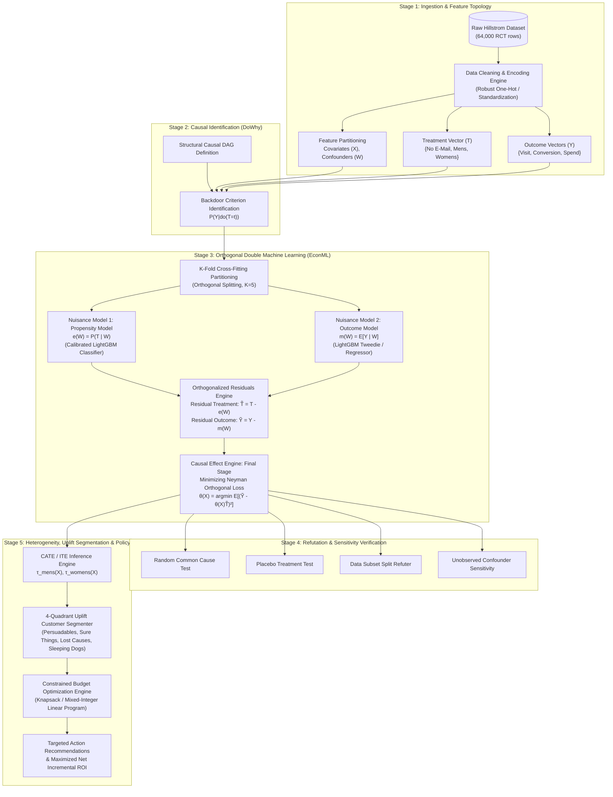

# EconoCausal: Enterprise ML & Causal AI Model Architecture
*Author: Principal Machine Learning Architect & Senior Causal AI Researcher*  
*Target Environment: Production / Research-Grade ML Pipeline*

---

## 1. End-to-End System & Data Flow Architecture

The EconoCausal pipeline enforces strict mathematical and architectural separation between nuisance parameter estimation, structural causal identification, heterogeneous treatment effect estimation, statistical refutation, and constrained policy optimization.



### Architectural Separation of Concerns
1. **Nuisance Estimation Layer**: Isolates predictive machine learning algorithms (optimizing $L_2$ or cross-entropy loss) from causal effect estimation.
2. **Causal Identification Layer**: Disallows black-box estimation prior to establishing formal structural identification (Backdoor/Frontdoor criterion) on the Directed Acyclic Graph (DAG).
3. **Orthogonalized Residual Layer**: Executes Neyman-orthogonal score projection, immunizing the parameter of interest against first-stage regularization biases.
4. **Refutation & Invariance Layer**: Runs falsification tests; failure to satisfy robustness bounds halts deployment.
5. **Prescriptive Policy Layer**: Decouples point estimates of uplift from the economic decision engine under real-world resource constraints.

---

## 2. Causal Identification & Graphical Model (DoWhy Layer)

### 2.1 Structural Causal Model (SCM) Specification
Let the system be defined by the tuple $\mathcal{M} = \langle V, U, \mathcal{F}, P(U) \rangle$ where:
- **Exogenous Variables ($U$)**: $U = \{U_X, U_T, U_Y\}$, mutually independent latent background factors.
- **Endogenous Variables ($V$)**:
  - $X \in \mathbb{R}^d$: Observable customer pre-treatment covariates and confounders (`recency`, `history`, `history_segment`, `mens`, `womens`, `zip_code`, `newbie`, `channel`).
  - $T \in \{0, 1, 2\}$: Categorical intervention assigned (`0: No E-Mail`, `1: Mens E-Mail`, `2: Womens E-Mail`).
  - $Y \in \mathbb{R}$: Target response variable (`visit` $\in \{0,1\}$, `conversion` $\in \{0,1\}$, or `spend` $\in \mathbb{R}_{\ge 0}$).
- **Structural Equations ($\mathcal{F}$)**:
  $$X := f_X(U_X)$$
  $$T := f_T(X, U_T)$$
  $$Y := f_Y(X, T, U_Y)$$

```mermaid
graph LR
    U[Unobserved Noise U] -.-> X((X: Customer Features))
    U -.-> T((T: Marketing Campaign))
    U -.-> Y((Y: Visit / Conversion / Spend))
    
    X -->|Confounding Path| T
    X -->|Direct Risk / Baseline| Y
    T -->|Causal Mechanism τ(X)| Y
    
    classDef observed fill:#1E293B,stroke:#38BDF8,stroke-width:2px,color:#F8FAFC;
    classDef unobserved fill:#334155,stroke:#94A3B8,stroke-width:1px,stroke-dasharray: 5 5,color:#CBD5E1;
    class X,T,Y observed;
    class U unobserved;
```

### 2.2 Conditional Independence & Backdoor Identification
The dataset originates from an A/B test (randomized control trial), meaning $T \perp\!\!\perp X$ by design in the sample. However, enterprise production systems must generalize to **observational, non-randomized environments** where historical targeting created confounding.

We establish the **Backdoor Criterion** relative to $(T, Y)$:
A set of variables $W \subseteq X$ satisfies the backdoor criterion if:
1. No node in $W$ is a descendant of $T$.
2. $W$ blocks every path between $T$ and $Y$ that contains an arrow into $T$.

Under the Backdoor Criterion, the causal effect is non-parametrically identified by the Adjustment Formula:
$$P(Y \mid do(T=t)) = \int_{\mathcal{X}} P(Y \mid T=t, X=x) P(X=x) dx$$

### 2.3 Positivity & Common Support Assumption
For valid causal identification across all subpopulations, the propensity score $e_t(x) = P(T=t \mid X=x)$ must satisfy strict positivity (common support):
$$\exists \epsilon > 0 \quad \text{such that} \quad \epsilon \le P(T=t \mid X=x) \le 1 - \epsilon, \quad \forall t \in \mathcal{T}, \, \forall x \in \text{supp}(X)$$
During data validation, any customer instances falling into $e_t(x) < 0.01$ or $e_t(x) > 0.99$ are trimmed or flagged for positivity violation.

### 2.4 Refutation Protocol
Before accepting any causal model for downstream ranking, the estimator must pass four rigorous refutation falsification checks:

| Refutation Test | Falsification Mechanism | Acceptance Criterion |
| :--- | :--- | :--- |
| **Random Common Cause** | Adds an independent synthetic noise variable $Z \sim \mathcal{N}(0, 1)$ into $W$ and re-estimates $\hat{\tau}$. | $| \hat{\tau}_{\text{new}} - \hat{\tau}_{\text{orig}} | / \hat{\tau}_{\text{orig}} < 0.05$ ($p > 0.05$) |
| **Placebo Treatment** | Replaces true treatment $T$ with a random permutation $\tilde{T} \sim \text{Permute}(T)$. | New estimated $\hat{\tau}_{\text{placebo}} \approx 0$ (95% CI contains 0) |
| **Data Subset Refuter** | Re-estimates effect on random subsets (replace fraction $\rho \in [0.8, 0.9]$). | Estimated effect invariant ($t$-test for difference fails to reject, $p > 0.10$) |
| **Unobserved Confounder Sensitivity** | Injects simulated confounder $U^*$ with confounding strength $\Gamma \in [1.0, 1.5]$. | Estimated effect does not flip sign within simulated range ($\Gamma \le 1.25$) |

---

## 3. Double Machine Learning (DML) Formulation (EconML Layer)

### 3.1 Mathematical Derivation: Robinson Transformation & Neyman Orthogonality
Consider the Partially Linear Model (PLM) for treatment heterogeneity:
$$Y = \theta(X) \cdot T + g(W) + \varepsilon, \quad \mathbb{E}[\varepsilon \mid X, W, T] = 0$$
$$T = m(W) + \eta, \quad \mathbb{E}[\eta \mid X, W] = 0$$

Where:
- $\theta(X) = \text{CATE}(X) = \mathbb{E}[Y(1) - Y(0) \mid X]$ is the parameter of interest.
- $g(W) = \mathbb{E}[Y \mid W, T=0]$ is an unknown nuisance function for baseline outcome.
- $m(W) = \mathbb{E}[T \mid W]$ is the propensity nuisance function.

Taking conditional expectations with respect to $W$:
$$\mathbb{E}[Y \mid W] = \theta(X) \cdot \mathbb{E}[T \mid W] + g(W)$$

Subtracting this conditional expectation from the primary outcome equation yields the **Robinson Residualized Form**:
$$\underbrace{Y - \mathbb{E}[Y \mid W]}_{\widetilde{Y}} = \theta(X) \cdot \underbrace{(T - \mathbb{E}[T \mid W])}_{\widetilde{T}} + \varepsilon$$
$$\widetilde{Y} = \theta(X) \cdot \widetilde{T} + \varepsilon$$

#### The Neyman Orthogonal Score
Standard OLS or plug-in ML estimates exhibit severe bias due to the convergence rate of first-stage non-parametric estimators: $\sqrt{n}(\hat{\theta} - \theta_0) \to \infty$ if nuisance estimators converge at rate $n^{-1/4}$.

DML constructs the Neyman orthogonal score $\psi(W, Y, T; \theta, \eta)$:
$$\psi(W, Y, T; \theta, \eta) = ( (Y - \hat{g}(W)) - \theta(X) (T - \hat{m}(W)) ) (T - \hat{m}(W))$$
The directional Gateaux derivative with respect to nuisance components vanishes at the true parameters:
$$\left. \partial_{\eta} \mathbb{E}[\psi(W, Y, T; \theta_0, \eta)] \right|_{\eta = \eta_0} = 0$$
This moment condition guarantees that first-stage estimation errors $\hat{g} - g_0$ and $\hat{m} - m_0$ have zero first-order impact on the target estimator $\hat{\theta}$, yielding $\sqrt{n}$-consistency and asymptotic normality:
$$\sqrt{n}(\hat{\theta} - \theta_0) \xrightarrow{d} \mathcal{N}(0, \sigma^2)$$

### 3.2 Nuisance Model Specifications
To achieve the optimal non-parametric convergence rate ($o_P(n^{-1/4})$), the nuisance architectures are chosen to address the specific statistical properties of the Hillstrom dataset:

1. **Propensity Model $\hat{m}(W) = P(T \mid W)$**:
   - Multi-class Calibrated LightGBM Classifier with Softmax cross-entropy loss.
   - Post-hoc Platt Scaling / Isotonic Regression calibration to prevent propensity overconfidence.
2. **Outcome Model $\hat{g}(W) = \mathbb{E}[Y \mid W]$**:
   - For `visit` & `conversion`: Calibrated Binary LightGBM with binary log-loss.
   - For `spend`: Zero-inflated continuous distribution (99% zeros). Modeled using a **Compound Poisson-Gamma (Tweedie)** deviance loss function with power parameter $p \in (1, 2)$ or a **Two-Stage Hurdle Model** ($\text{Pr}(Y > 0 \mid W) \times \mathbb{E}[Y \mid Y > 0, W]$).

### 3.3 $K$-Fold Cross-Fitting Scheme
To prevent overfitting between the nuisance predictions and the target parameter estimation, EconoCausal implements $K$-Fold Cross-Fitting ($K = 5$):

```
Dataset D Partitioned into K=5 Folds: {I_1, I_2, I_3, I_4, I_5}
─────────────────────────────────────────────────────────────────────────────
Iteration k=1:
  Train Nuisance Models ĝ_{-1}, m̂_{-1} on {I_2 ∪ I_3 ∪ I_4 ∪ I_5}
  Predict Residuals Ỹ_1 = Y_1 - ĝ_{-1}(W_1), T̃_1 = T_1 - m̂_{-1}(W_1) on Fold I_1
Iteration k=2:
  Train Nuisance Models ĝ_{-2}, m̂_{-2} on {I_1 ∪ I_3 ∪ I_4 ∪ I_5}
  Predict Residuals Ỹ_2 on Fold I_2
...
Pooled Estimation:
  Regress concatenated residuals [Ỹ_1, ..., Ỹ_K] on [T̃_1, ..., T̃_K] 
  to fit θ̂(X) across the complete dataset.
─────────────────────────────────────────────────────────────────────────────
```

### 3.4 Causal Estimator Selection Matrix

| Estimator Family | Algorithmic Mechanism | Pros | Cons | Production Decision |
| :--- | :--- | :--- | :--- | :--- |
| **LinearDML** | Fits $\theta(X) = \beta^T X$ via regularized linear projection of $\widetilde{Y}$ on $\widetilde{T} \otimes X$. | Highly interpretable, closed-form confidence intervals, fast inference ($O(d)$). | Misses deep non-linear interaction surfaces. | **Baseline & Statistical Benchmark** |
| **CausalForestDML** | Fits forest of orthogonal causal trees, maximizing treatment heterogeneity splits. | Non-parametric, captures complex feature non-linearities, local asymptotic normality. | Memory intensive ($O(N \cdot B)$), slower batch scoring. | **Primary Production Model for Heterogeneity** |
| **SparseLinearDML** | $\ell_1$-regularized DML with debiased Lasso for high-dimensional regimes. | Automatic feature selection for effect modification. | Requires careful penalty calibration. | **Feature Screening Benchmark** |
| **X-Learner** | Two-stage meta-learner imputing counterfactual unobserved effects. | Well-suited for extreme treatment imbalance ($P(T=1) \ll 0.5$). | Lacks Neyman orthogonality; prone to regularization bias. | **Exploratory Comparison Only** |

---

## 4. Multi-Treatment & Multi-Outcome Strategy

### 4.1 Multi-Treatment Formalization
The Hillstrom experiment contains three treatment arms:
$$\mathcal{T} = \{0: \text{No E-Mail (Control)}, \; 1: \text{Mens E-Mail}, \; 2: \text{Womens E-Mail}\}$$

We parameterize treatment as a one-hot encoded vector $T = [T^{(1)}, T^{(2)}]^T \in \{0, 1\}^2$ with baseline $T^{(0)} = [0, 0]^T$. The causal model estimates a bivariate treatment effect vector:
$$\boldsymbol{\tau}(X) = \begin{bmatrix} \tau_{\text{mens}}(X) \\ \tau_{\text{womens}}(X) \end{bmatrix} = \begin{bmatrix} \mathbb{E}[Y(T=1) - Y(T=0) \mid X] \\ \mathbb{E}[Y(T=2) - Y(T=0) \mid X] \end{bmatrix}$$

The residualized final-stage formulation becomes:
$$\widetilde{Y}_i = \boldsymbol{\tau}(X_i)^T \widetilde{\mathbf{T}}_i + \varepsilon_i, \quad \widetilde{\mathbf{T}}_i = \mathbf{T}_i - \mathbb{E}[\mathbf{T} \mid W_i] \in \mathbb{R}^2$$

### 4.2 Multi-Outcome Joint Optimization
Marketing decisions involve a multi-objective trade-off between user engagement (`visit`), purchase intent (`conversion`), and monetary revenue (`spend`):

$$\boldsymbol{\tau}_Y(X) = \left( \tau_{\text{visit}}(X), \; \tau_{\text{conv}}(X), \; \tau_{\text{spend}}(X) \right)$$

Rather than relying on ad-hoc scalarization, we compute the **Net Expected Incremental Monetary Value (EIMV)**:
$$\text{EIMV}_t(X) = \tau_{\text{spend}, t}(X) \cdot \text{Gross Margin} - \text{Unit Delivery Cost}_t - \text{Discount Cost}_t$$

---

## 5. Uplift Customer Segmentation & Policy Optimization Engine

### 5.1 Uplift Response Quadrants
For every individual $i$ under treatment $t$, their latent response type is classified into one of four mutually exclusive operational quadrants:

$$\mathcal{Q}_i = \begin{cases} 
\textbf{Persuadables} & \text{if } \tau_i(X) > \gamma_{\text{threshold}} \\
\textbf{Sure Things} & \text{if } \mathbb{E}[Y_i(0) \mid X] > \alpha \text{ and } |\tau_i(X)| \le \gamma_{\text{threshold}} \\
\textbf{Lost Causes} & \text{if } \mathbb{E}[Y_i(0) \mid X] \le \alpha \text{ and } \mathbb{E}[Y_i(t) \mid X] \le \alpha \\
\textbf{Sleeping Dogs} & \text{if } \tau_i(X) < -\gamma_{\text{threshold}}
\end{cases}$$

```
                          Baseline Outcome E[Y(0)|X]
                                Low          High
                      ┌───────────────────┬───────────────────┐
                 High │                   │                   │
                      │   Persuadables    │    Sure Things    │
  Incremental         │  (TARGET FIRST)   │  (DO NOT WASTE)   │
  Lift τ(X)           │                   │                   │
                      ├───────────────────┼───────────────────┤
                 Low  │    Lost Causes    │   Sleeping Dogs   │
                      │    (DO NOT SEND)  │  (NEVER CONTACT)  │
                      │                   │                   │
                      └───────────────────┴───────────────────┘
```

### 5.2 Constrained Policy Optimization (Mixed-Integer Linear Program)
Let $z_{i, t} \in \{0, 1\}$ be the binary decision variable indicating whether customer $i \in \{1, \dots, N\}$ receives treatment $t \in \{1, 2\}$ ($z_{i, 0} = 1 - z_{i, 1} - z_{i, 2}$).

The prescriptive optimization problem is formulated as:
$$\max_{\{z_{i, t}\}} \sum_{i=1}^N \sum_{t=1}^2 z_{i, t} \cdot \left( \hat{\tau}_{\text{spend}, t}(X_i) \cdot \mu - c_t \right)$$

Subject to:
1. **Budgetary Constraint**:
   $$\sum_{i=1}^N \sum_{t=1}^2 z_{i, t} \cdot c_t \le B_{\text{total}}$$
2. **Mutual Exclusivity Constraint**:
   $$\sum_{t=1}^2 z_{i, t} \le 1, \quad \forall i \in \{1, \dots, N\} \quad (z_{i, t} \in \{0, 1\})$$
3. **Channel Volume Capacity Constraints**:
   $$\sum_{i=1}^N z_{i, t} \le V_{\max, t}, \quad \forall t \in \{1, 2\}$$

Where:
- $\mu$: Net revenue contribution margin (e.g., $0.40$).
- $c_t$: Direct marginal cost of intervention $t$ (e.g., $c_{\text{email}} = \$0.05$).
- $B_{\text{total}}$: Total campaign budget allocated.

For large-scale deployments ($N > 10^6$), the relaxation to a continuous fractional knapsack solved via greedy sorting on **Marginal Return on Intervention Cost (MROIC)** yields an optimal $O(N \log N)$ algorithm:
$$\text{MROIC}_{i, t} = \frac{\hat{\tau}_{\text{spend}, t}(X_i) \cdot \mu - c_t}{c_t}$$

---

## 6. Validation & Offline Causal Metrics Suite

Standard predictive ML metrics (AUC-ROC, RMSE) are fundamentally invalid for causal inference because the ground-truth counterfactual $Y_i(1) - Y_i(0)$ is never observed for any single individual (Fundamental Problem of Causal Inference). 

We deploy a dedicated causal validation suite:

### 6.1 Qini Curve & Qini Score
Sort test instances in descending order of predicted uplift $\hat{\tau}(X_{(1)}) \ge \hat{\tau}(X_{(2)}) \ge \dots \ge \hat{\tau}(X_{(N)})$. For a fraction $\phi \in [0, 1]$ of the ranked population:

$$Q(\phi) = n_{t, 1}(\phi) - n_{c, 1}(\phi) \cdot \frac{N_t(\phi)}{N_c(\phi)}$$
Where $n_{t, 1}(\phi)$ and $n_{c, 1}(\phi)$ are the cumulative positive outcomes in the treated and control groups within the top $\phi$ fraction.

The **Qini Score ($Q_{\text{score}}$)** measures the area between the model's Qini curve and the random targeting diagonal:
$$Q_{\text{score}} = \int_0^1 \left( Q(\phi) - \phi \cdot Q(1) \right) d\phi$$

### 6.2 Area Under the Uplift Curve (AUUC)
The standard uplift curve computes the cumulative uplift:
$$U(\phi) = \left( \frac{n_{t, 1}(\phi)}{N_t(\phi)} - \frac{n_{c, 1}(\phi)}{N_c(\phi)} \right) \cdot (N_t(\phi) + N_c(\phi))$$
$$\text{AUUC} = \int_0^1 U(\phi) d\phi$$

### 6.3 Semi-Synthetic Ground-Truth Benchmark (DGP Simulation)
To compute true Mean Squared Error on CATE ($\text{PEHE}$ - Precision in Estimating Heterogeneous Effects):
$$\text{PEHE} = \frac{1}{N} \sum_{i=1}^N \left( \hat{\tau}(X_i) - \tau^*_{\text{true}}(X_i) \right)^2$$
We construct a semi-synthetic data generating process (DGP) using the empirical Hillstrom covariates $X$ while injecting a known synthetic non-linear ground truth:
$$\tau^*(X) = 2.5 \cdot \mathbf{1}_{[\text{recency} < 3]} + 1.8 \cdot \log(1 + \text{history}) \cdot \mathbf{1}_{[\text{channel} = \text{'Multichannel'}]}$$
This synthetic oracle validates estimator convergence before running production inference.

---

## 7. Software Design Patterns & Extensibility

The codebase adheres strictly to SOLID design principles, utilizing the **Factory**, **Strategy**, and **Pipeline** design patterns.

### 7.1 Abstract Base Classes & Type Contracts

```python
"""
Core architectural interfaces for EconoCausal pipeline.
Location: ml/
"""
from abc import ABC, abstractmethod
from typing import Dict, Any, Tuple, Optional
import numpy as np
import pandas as pd

class BaseNuisanceModel(ABC):
    """Abstract Strategy for first-stage nuisance models (e(W) and m(W))."""
    
    @abstractmethod
    def fit(self, W: np.ndarray, target: np.ndarray) -> "BaseNuisanceModel":
        """Fits the nuisance model using appropriate loss minimization."""
        pass

    @abstractmethod
    def predict(self, W: np.ndarray) -> np.ndarray:
        """Returns conditional expectation E[target | W]."""
        pass

    @abstractmethod
    def predict_proba(self, W: np.ndarray) -> np.ndarray:
        """Returns calibrated probabilities for discrete targets."""
        pass


class BaseCausalEstimator(ABC):
    """Abstract Interface for Causal Estimators (DML, Causal Forests, Meta-Learners)."""
    
    @abstractmethod
    def fit(
        self, 
        Y: np.ndarray, 
        T: np.ndarray, 
        X: np.ndarray, 
        W: Optional[np.ndarray] = None
    ) -> "BaseCausalEstimator":
        """Executes cross-fitting and Neyman orthogonal final estimation."""
        pass

    @abstractmethod
    def estimate_ate(self) -> Tuple[float, Tuple[float, float]]:
        """Returns (point_estimate, (lower_ci, upper_ci)) for population ATE."""
        pass

    @abstractmethod
    def estimate_cate(self, X: np.ndarray) -> np.ndarray:
        """Computes conditional average treatment effect vector for given features."""
        pass


class BasePolicyOptimizer(ABC):
    """Abstract Strategy for Prescriptive Resource Allocation."""
    
    @abstractmethod
    def optimize(
        self, 
        cate_matrix: np.ndarray, 
        costs: np.ndarray, 
        budget: float, 
        constraints: Dict[str, Any]
    ) -> np.ndarray:
        """Solves optimization problem and returns binary allocation matrix Z in {0, 1}^{N x T}."""
        pass


class BaseCausalRefuter(ABC):
    """Contract for DoWhy refutation tests."""
    
    @abstractmethod
    def refute(
        self, 
        causal_model: Any, 
        estimand: Any, 
        estimate: Any, 
        method: str, 
        **kwargs
    ) -> Dict[str, Any]:
        """Runs falsification challenge and returns p-values and effect shifts."""
        pass
```

### 7.2 Configuration Schemas (`configs/`)

```yaml
# configs/model_params.yaml (Schema Blueprint)
causal_model:
  type: "CausalForestDML"
  cv_folds: 5
  random_state: 42
  nuisance:
    treatment_model:
      algorithm: "LightGBMClassifier"
      params:
        n_estimators: 200
        max_depth: 5
        learning_rate: 0.03
        objective: "multiclass"
        calibration: "isotonic"
    outcome_model:
      algorithm: "LightGBMRegressor"
      params:
        n_estimators: 250
        max_depth: 6
        learning_rate: 0.03
        objective: "tweedie"
        tweedie_variance_power: 1.5
  effect_model:
    n_estimators: 500
    min_samples_leaf: 20
    max_depth: 8
    subforest_size: 4

optimization:
  gross_margin_rate: 0.40
  cost_per_treatment:
    mens_email: 0.05
    womens_email: 0.05
  budget_ceiling: 2500.00
  algorithm: "greedy_knapsack"
```
